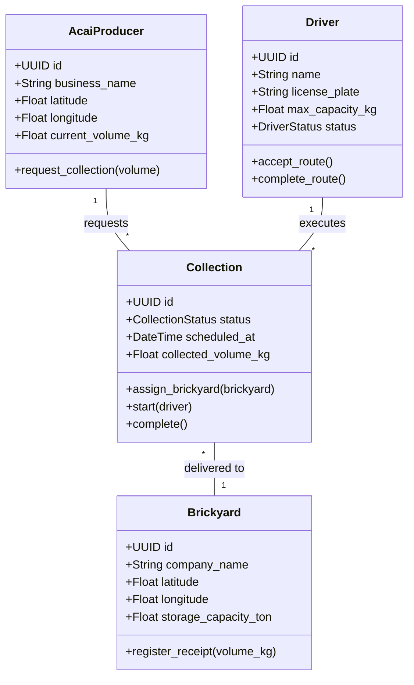
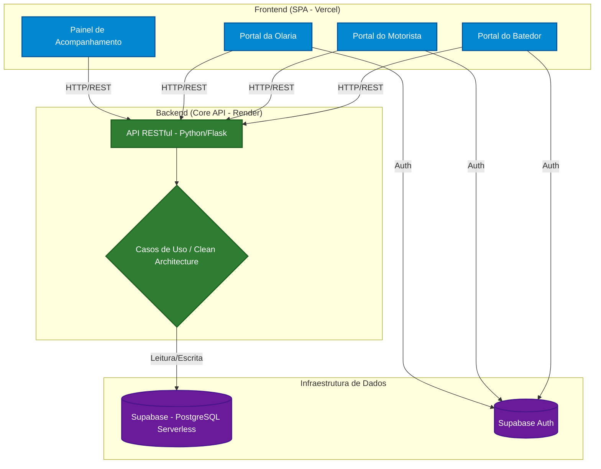

# AçaíLoop — Logística Verde B2B

<p align="center">
  <a href="https://acailoop.vercel.app/" target="_blank">
    
  </a>
</p>

<p align="center">
  
  
  
  
  
</p>

> **Protótipo de extensão universitária** | Região Metropolitana de Belém, PA

> **Status:** MVP completo — ciclo de coleta funcional de ponta a ponta (Batedor → Olaria → Motorista).

---

## O Problema e a Visão

A Região Metropolitana de Belém processa toneladas de açaí diariamente. O resultado: **caroços descartados de forma inadequada** por centenas de batedores espalhados pela cidade, gerando passivos ambientais urbanos.

**AçaíLoop** resolve esse gargalo logístico conectando três atores em uma cadeia circular:

| Ator | Papel | Dor Resolvida |
|---|---|---|
| **Batedores de Açaí** | Gerador de resíduo | Descarte inadequado e custo de remoção |
| **Olarias** | Consumidor de biomassa | Custo de aquisição de insumo combustível |
| **Motoristas de Frete** | Agente logístico | Rotas ociosas e baixa ocupação de carga |

A plataforma **otimiza rotas de coleta** e elimina a fricção de coordenação entre esses agentes, promovendo economia circular com impacto ambiental mensurável.

---

## Demonstração Visual

.jpeg)

.jpeg)

---

## Interface e Usabilidade (Frontend)

O frontend foi desenvolvido com foco em **Mobile First**, garantindo que trabalhadores operacionais (motoristas e batedores) consigam utilizar o sistema na rua sem atritos.

Principais entregas de UI:
* **Navegação Responsiva:** Navbar com menu hambúrguer dinâmico e transições suaves.
* **Painel de Rastreamento (HistoryPage):** Renderização condicional de status usando badges coloridas.
* **Roteirização Dinâmica:** Quando uma coleta entra no status `ON_ROUTE`, o sistema exibe automaticamente os endereços exatos de origem e destino na interface do motorista.

---

## Estratégia de FinOps — Custo Zero no MVP

Embora a arquitetura pudesse ser inteiramente provisionada na AWS, adotamos uma estratégia de **Bootstrapping com FinOps** desde o início. Instâncias pagas como RDS e EC2 gerariam custos fixos ociosos numa fase de prototipação onde o foco é validação com usuários reais, não escala.

**Decisão:** desacoplar cada camada em serviços gerenciados com *free tiers* permanentes e generosos:

| Camada | Serviço | Justificativa |
|---|---|---|
| Banco de Dados | **Supabase** | PostgreSQL real + Auth + Realtime no free tier |
| Backend (API) | **Render** | Deploy de containers Python/Flask sem custo fixo |
| Frontend (SPA) | **Vercel** | Edge network global com CI/CD automático |

> **Resultado:** infraestrutura Cloud-Native com **Custo Operacional Mensal de $0,00** durante a fase piloto — recursos integralmente direcionados à validação de produto.

---

## Decisão Arquitetural — Por que Clean Architecture num Protótipo?

A adoção de **Clean Architecture** num protótipo pode parecer over-engineering à primeira vista. A escolha é deliberada e justificada:

> *O núcleo de negócio do AçaíLoop — a máquina de estados da coleta e as regras que definem como cada ator interage — **não deve depender do Flask, do Supabase ou de qualquer framework**. Isso garante que, ao evoluir o protótipo para produção, nenhuma regra de negócio precise ser reescrita.*

Esta separação é implementada em três camadas:

```
acailoop/
├── domain/
│   └── entities.py
├── use_cases/
│   ├── request_collection.py
│   ├── assign_brickyard.py
│   ├── assign_driver.py
│   └── complete_collection.py
├── infrastructure/
│   ├── api/
│   │   └── routes.py
│   └── database/
│       └── supabase_client.py
└── frontend/
    └── src/
        ├── pages/
        │   ├── LandingPage.jsx
        │   ├── AuthPage.jsx
        │   ├── ProducerPage.jsx
        │   ├── DriverPage.jsx
        │   ├── BrickyardPage.jsx
        │   ├── HistoryPage.jsx
        │   └── ProfilePage.jsx
        └── components/
            └── Navbar.jsx
```

---

## 1. Modelo de Domínio

Entidades centrais do sistema. O núcleo é **completamente isolado** de frameworks e banco de dados — pode ser testado em memória, sem nenhuma dependência externa.



> **CollectionStatus:** `AWAITING_BRICKYARD → AWAITING_DRIVER → ON_ROUTE → COMPLETED`. Todas as transições são validadas na camada de Use Cases, garantindo que nenhuma rota seja iniciada sem origem e destino confirmados.

---

## 2. Arquitetura de Componentes

Topologia de nuvem com separação clara entre interface, regras de negócio e infraestrutura de dados.



---

## 3. Inteligência de Roteirização — Fluxo de 4 Estágios

O sistema garante que nenhum motorista inicie uma rota sem origem e destino confirmados:

```
AcaiProducer requests collection
        │
        ▼
API creates Collection [AWAITING_BRICKYARD]
        │
        ▼
Available Brickyard accepts → defines destination address
        │
        ▼
Collection updated to [AWAITING_DRIVER]
        │
        ▼
Driver sees fully defined route → accepts
        │
        ▼
Collection updated to [ON_ROUTE]
        │
        ▼
Brickyard confirms physical receipt
        │
        ▼
Collection finalized [COMPLETED] — metrics updated
```

---

## 4. Endpoints da API

| Método | Rota | Descrição |
|---|---|---|
| `GET` | `/health` | Verifica status da API |
| `POST` | `/collections` | Batedor abre nova solicitação |
| `GET` | `/collections` | Lista coletas filtradas por status e usuário |
| `PATCH` | `/collections/:id` | Atualiza status, motorista ou olaria |
| `GET` | `/metrics` | Retorna métricas agregadas para a Landing Page |

---

## 5. Stack Completo

```
Backend:      Python 3.14 · Flask · Flask-CORS · Clean Architecture
Banco:        Supabase (PostgreSQL) · Supabase Auth (JWT)
Frontend:     React 18 · Vite · Tailwind CSS · React Router DOM
Deploy:       Vercel (frontend) · Render (API)
```

---

## Como Rodar Localmente

### Pré-requisitos
- Python 3.14+
- Node.js 18+
- Conta no Supabase com a tabela `collections` criada

### Backend

```bash
python -m venv .venv
.venv\Scripts\activate       # Windows
source .venv/bin/activate    # Linux/Mac

pip install -r requirements.txt

python -X dev app.py
```

### Frontend

```bash
cd frontend
npm install
npm run dev
```

### Variáveis de Ambiente

Crie `.env` na raiz do projeto:
```
SUPABASE_URL=https://seu-projeto.supabase.co
SUPABASE_KEY=sua_secret_key
```

Crie `frontend/.env`:
```
VITE_SUPABASE_URL=https://seu-projeto.supabase.co
VITE_SUPABASE_KEY=sua_publishable_key
VITE_API_URL=https://seu-projeto.onrender.com
```

> Em desenvolvimento local, `VITE_API_URL` pode ser omitido — o frontend faz fallback automático para `http://127.0.0.1:5000`.

---

## Limitações Conhecidas do Protótipo

- **Cold start:** o free tier do Render hiberna após 15 min de inatividade. Mitigável com upgrade.
- **Coordenadas fixas:** latitude e longitude do batedor são fixas no protótipo. Em produção, seriam capturadas via Geolocation API do browser.
- **Python 3.14:** requer o flag `-X dev` para inicializar corretamente.

---

## Contexto do Projeto

Desenvolvido como **projeto de extensão universitária**, com foco em impacto socioambiental real na Região Metropolitana de Belém. O objetivo do protótipo é validar a hipótese de adesão com batedores reais antes de qualquer investimento em infraestrutura paga.

---

*Feito em Belém do Pará.*