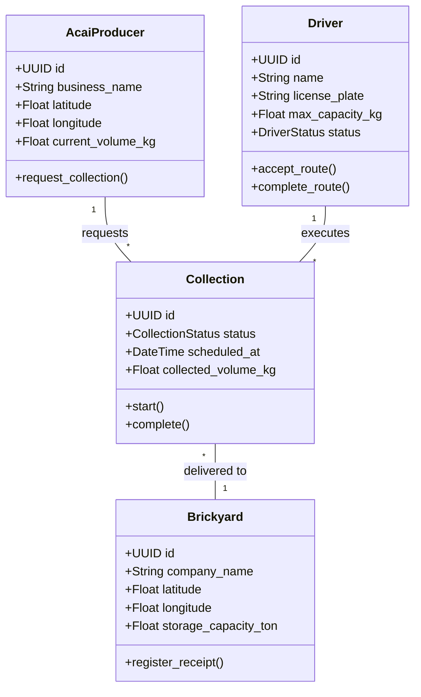
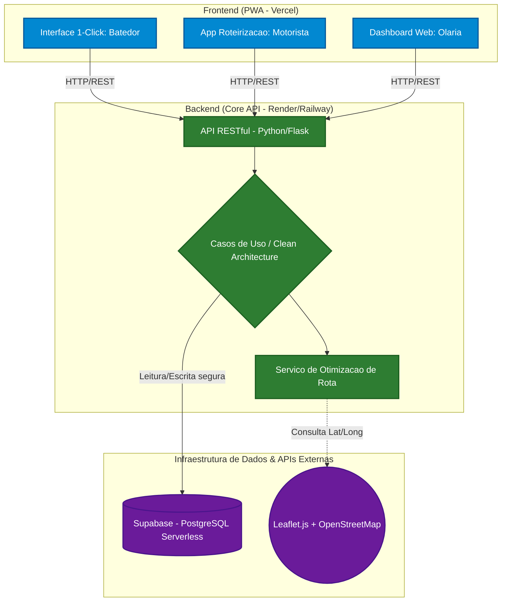

# 🫐 AçaíLoop — Logística Verde B2B

> **Protótipo de extensão universitária** | Região Metropolitana de Belém, PA

> 🚧 **Status:** Camada de domínio implementada. Desenvolvimento dos casos de uso em andamento.

---

## 🎯 O Problema e a Visão

A Região Metropolitana de Belém processa toneladas de açaí diariamente. O resultado: **caroços descartados de forma inadequada** por centenas de batedores espalhados pela cidade, gerando passivos ambientais urbanos.

**AçaíLoop** resolve esse gargalo logístico conectando três atores em uma cadeia circular:

| Ator | Papel | Dor Resolvida |
|---|---|---|
| 🏪 **Batedores de Açaí** | Gerador de resíduo | Descarte inadequado e custo de remoção |
| 🚛 **Motoristas de Frete** | Agente logístico | Rotas ociosas e baixa ocupação de carga |
| 🧱 **Olarias** | Consumidor de biomassa | Custo de aquisição de insumo combustível |

A plataforma **otimiza rotas de coleta** e elimina a fricção de coordenação entre esses agentes, promovendo economia circular com impacto ambiental mensurável.

---

## 💸 Estratégia de FinOps — Custo Zero no MVP

Embora a arquitetura pudesse ser inteiramente provisionada na AWS, adotamos uma estratégia de **Bootstrapping com FinOps** desde o início. Instâncias pagas como RDS e EC2 gerariam custos fixos ociosos numa fase de prototipação onde o foco é validação com usuários reais, não escala.

**Decisão:** desacoplar cada camada em serviços gerenciados com *free tiers* permanentes e generosos:

| Camada | Serviço | Justificativa |
|---|---|---|
| 🗄️ Banco de Dados | **Supabase** | PostgreSQL real + Auth + Realtime no free tier |
| ⚙️ Backend (API) | **Render / Railway** | Deploy de containers Python/Flask sem custo fixo |
| 🌐 Frontend (PWA) | **Vercel** | Edge network global com CI/CD automático |
| 🗺️ Geolocalização | **Leaflet.js + OpenStreetMap** | Substitui APIs pagas com cobertura completa de Belém |

> **Resultado:** infraestrutura Cloud-Native com **Custo Operacional Mensal de $0,00** durante a fase piloto — recursos integralmente direcionados à validação de produto.

---

## 🏛️ Decisão Arquitetural — Por que Clean Architecture num Protótipo?

A adoção de **Clean Architecture** num protótipo pode parecer over-engineering à primeira vista. A escolha é deliberada e justificada:

> *O núcleo de negócio do AçaíLoop — as regras que definem como uma Coleta é criada, como um Motorista é alocado, como uma Olaria confirma recebimento — **não deve depender do Flask, do Supabase ou de qualquer framework**. Isso garante que, ao evoluir o protótipo para produção (trocar Supabase por RDS, Flask por FastAPI), nenhuma regra de negócio precise ser reescrita.*

Esta separação é implementada em três camadas:

```
acailoop/
├── domain/              # Pure business entities (no external dependencies)
│   └── entities.py      # AcaiProducer, Driver, Brickyard, Collection ✅
├── use_cases/           # Application rules (in progress)
└── infrastructure/      # Concrete implementations: Flask, Supabase (in progress)
```

---

## 1. Modelo de Domínio

Entidades centrais do sistema. Este núcleo é **completamente isolado** de frameworks, bibliotecas e banco de dados — pode ser testado em memória, sem nenhuma dependência externa.



> **Note on `CollectionStatus`:** possible states are `PENDING → ON_ROUTE → COMPLETED`. State transitions are validated in the Use Cases layer, not in the database.

---

## 2. Arquitetura de Componentes

Topologia de nuvem com separação clara entre interface, regras de negócio e infraestrutura de dados.



---

## 3. Algoritmo de Roteirização

O `Serviço de Otimização de Rota` é o **coração do valor entregue pela plataforma**. No protótipo, utilizamos uma heurística de **Nearest Neighbor** sobre as coordenadas geográficas dos batedores com coleta pendente:

1. Motorista aceita uma rota disponível.
2. O serviço consulta todos os `Batedores` com `status = PENDENTE` dentro de um raio configurável.
3. A heurística ordena as paradas por proximidade sequencial, minimizando distância percorrida.
4. A rota gerada é persistida como uma `Coleta` no estado `EM_ROTA`.

> **Evolução planejada:** integração com OSRM (Open Source Routing Machine) para considerar malha viária real de Belém, em substituição à distância euclidiana do protótipo.

---

## 4. Fluxo Principal — Ciclo de uma Coleta

```
AcaiProducer requests collection (current_volume_kg)
        │
        ▼
API creates Collection [PENDING] in Supabase
        │
        ▼
Available Driver receives notification
        │
        ▼
Routing algorithm generates optimized sequence
        │
        ▼
Driver executes collection → collection.start()
        │
        ▼
Collection updated to [ON_ROUTE]
        │
        ▼
Brickyard confirms receipt → register_receipt()
        │
        ▼
Collection finalized [COMPLETED] — volume recorded
```

---

## 5. Stack Completo

```
Backend:     Python 3.14 · Flask · Clean Architecture
Banco:       Supabase (PostgreSQL) · Autenticação JWT via Supabase Auth
Frontend:    PWA · Leaflet.js · OpenStreetMap
Deploy:      Vercel (frontend) · Render ou Railway (API)
Testes:      pytest · repositórios in-memory para domain tests
```

---

## ⚠️ Limitações Conhecidas do Protótipo

- **Cold start:** o free tier do Render hiberna após 15 min de inatividade (~30s na primeira requisição). Aceitável para validação, mitigável com Railway ou upgrade.
- **Roteirização simplificada:** a heurística atual não considera trânsito real, janelas de horário ou capacidade de carga acumulada por parada.
- **Volume manual:** o `current_volume_kg` é informado pelo próprio `AcaiProducer`. Em produção, isso seria estimado por histórico ou sensor.

---

## 🤝 Contexto do Projeto

Desenvolvido como **projeto de extensão universitária**, com foco em impacto socioambiental real na Região Metropolitana de Belém. O objetivo do protótipo é validar a hipótese de adesão com batedores reais antes de qualquer investimento em infraestrutura paga.

---

*Feito com 🫐 em Belém do Pará.*
